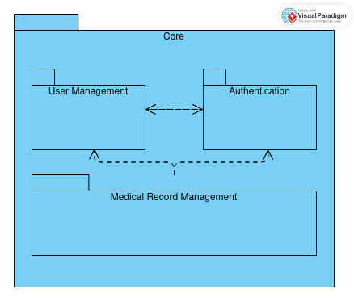
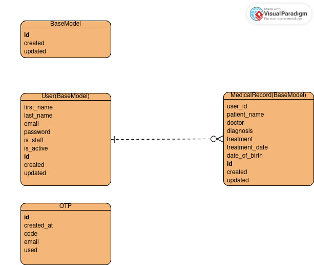

# Anavara Coding Challenge

## Introduction
This project is a solution to the coding challenge for Anavara's recruitment process.
This document also serves as the general document for the project

## Design Decision
After careful consideration of whether to Mono or to Micro, I decided to go with the 
monolithic code structure. I know, danger alert, but hear me out.

#### Microservice
It's great in principle, but until you are fully ready and understand the requirements, 
you should not rush into implementing it.
- in the case of Django, each service will need to become a project, 
which means there will be a lot duplication and additional overhead of 
managing common shared code, testing and deployment Infrastructure, configuration management etc
- Needs dedicated teams to develop and manage each service.
- Requires significant time to setup and get going.

#### Monolith
Most of the arguments against monoliths are around less agility - changes to any 
part requires the entire application to be tested, build and redeployed. 
Technology contraints - inablity to adopt new and emerging tehnologies, 
bugs can have wider blast radius and can cause the entire system to go down. However, the benefits include;
- Less complexity and overhead due to authentication interactions between services
- Common code sharing, reuse, and a unified version control and management
- Easier and faster to develop, deploy, manage and maintain
- Easier to test end-to-end

## Project structure
I adopted modular monolithic code structure, by designing system in such a way 
that every path of the system is modular and very little need for interaction 
and dependency. With clear boundaries and interaction points.
I have broken down the application into three modules (`users`, `authentication`, `records`)
Here is a high level overview of the project structure


Please also refer to the ERD attached


## Features
 - django-restframework: RESTful API
 - drf-spectacular: API docs

### pytest
You can run pytest on CLI:
```(project_root)/anavara/$ python -m pytest```

## environment setup
### Runtime
- python 3.10.12
- [pyenv](https://github.com/pyenv/pyenv)
```
#after setup
pyenv install 3.10.12
```
- [virtualenv](https://github.com/pyenv/pyenv-virtualenv)
```
#after setup
pyenv virtualenv 3.10.12 anavara-django
pyenv activate anavara-django
```

### Install dependencies
```
pip install -r requirements.txt
```
### Run Server
access api documentation via `http://localhost:8000/docs/`
```
#When setting up for the first time, and follow the prompt to create admin user
python manage.py createsuperuser
python manage.py runserver
```

## Notes on scaling
To scale applications with this type of structure, there are a few things you can do
- Add a cache. Django has a built-in caching framework
- Optimize database access with queries like `.select_related()`, `.prefetch_related()` on queryset with related items to avoid N + 1 queries
- Use `.update()` queryset method to perform bulk_updates
- Use `.values_list()` and construct lookup `dict` or `set` for membership/existence checks, to avoid querying the db regularly
- Avoid aggregation functions link `COUNT`, `SUM` etc, maintain a separate table that keeps track of this as items/transactions are added.

- Use Multiple Databases, django supports database routing for database setups that have replication setup. A master DB can be used for write, and others can be used for read.
- Add more servers, by adding a load-balancer configured to distribute traffic systematically